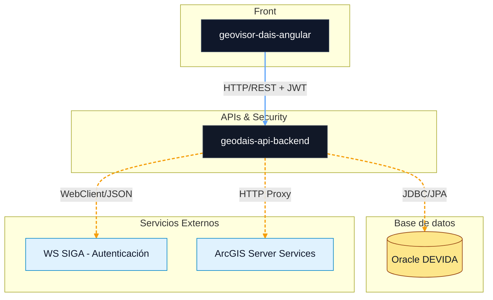

# Sistema GeoDAIS - Módulo de Seguridad y Visor

Backend de seguridad y servicios geográficos desarrollado con **Spring Boot 3.5.7** y **Java 21**. Encargado de la gestión de autenticación delegada, control de sesiones persistentes y proxy seguro para servicios de ArcGIS.

---

## 🚀 Tecnologías

- Java 21 (OpenJDK / Amazon Corretto)
- Spring Boot 3.5.7
- Spring Security & JWT (jjwt 0.12.6)
- Spring Data JPA & MyBatis (Soporte dual de persistencia)
- Oracle Database (OJDBC11)
- Springdoc OpenAPI (Swagger) 2.5.0
- WebClient (Spring WebFlux para consumo de WS externos)
- Maven 3.9+

---

## 📦 Requisitos previos

- JDK 21 instalado.
- Maven 3.9.x.
- Instancia de Oracle Database configurada.
- Acceso a la red del servicio de autenticación SIGA.

---

## ⚙️ Instalación

Clonar el repositorio y compilar el proyecto:

```bash
git clone <url-del-repositorio-geodais>
cd geodais
mvn install
```

---

## ▶️ Ejecución en desarrollo

Para iniciar el servidor de desarrollo:

```bash
mvn spring-boot:run
```

La API estará disponible en:
`http://localhost:8080/`

Documentación interactiva (Swagger UI):
`http://localhost:8080/swagger-ui/index.html`

---

## 🏗️ Build de producción

El proyecto está configurado para generar un archivo **WAR** que incluye automáticamente los recursos compilados del frontend (Angular):

```bash
mvn clean package
```

El artefacto final se genera en:
`target/geodais.war`

---

## 🧪 Testing

Ejecutar pruebas unitarias e instrumentación de agentes:

```bash
mvn test
```

---

## 📁 Estructura del proyecto

```
src/main/java/pe/gob/devida/geodais/
 ├── config/            # Seguridad JWT, CORS y OpenAPI
 ├── controller/        # Controladores REST (Auth, Sesiones)
 ├── model/             # Entidades JPA, DTOs y Mapeos MyBatis
 ├── repository/        # Repositorios de datos (Oracle)
 ├── service/           # Lógica de negocio y consumo de WebServices
 └── GeodaisApplication.java
```

---

## 🔐 Configuración de entornos

Los orígenes permitidos para CORS y URLs de servicios se gestionan en:
- `src/main/java/pe/gob/devida/geodais/config/CorsConfig.java`
- `src/main/resources/application.yml`

---

## 📦 Diagrama de componentes:



## 🌍 Links de las publicaciones:

Desarrollo / QA

Producción